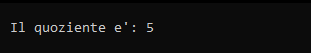

## Recursive Integer Division

Implementazione ricorsiva dell'algoritmo di calcolo di una divisione intera tra due interi.

# Componenti della ricorsione

1. **Condizioni di terminazione:** `if(dividendo < divisore)`
2. **Istruzione di terminazione:** `return 0`
3. **Passo di avvicinamento:** `dividendo - divisore`
4. **Chiamata ricorsiva:** `1 + divisione(dividendo - divisore, divisore)`

# Utilizzo
1. Crea in Code::Blocks un nuovo progetto.
2. Copia il codice sorgente.
3. Compila ed esegui.

# Codice sorgente

```cpp
#include <iostream>

int divisione(int dividendo, int divisore);

int main()
{

    int divid = 25;
    int divis = 5;
    int quoz;
    if((quoz = divisione(divid, divis)) < 0){
        std::cout << std::endl;
        std::cout << "Errore: divisore uguale a 0";
        std::cout << std::endl;
    }else{
        std::cout << std::endl;
        std::cout << "\tIl quoziente e': " << quoz;
        std::cout << std::endl;
    }

    return 0;
}

int divisione(int dividendo, int divisore){
    if(divisore == 0)
        return -1;

    if(dividendo < divisore)
        return 0;
    else
        return 1 + divisione(dividendo - divisore, divisore);
}
```

# Output



# Funzionamento

```text
divisione(25, 5)
= 1 + divisione(20, 5)
= 1 + (1 + divisione(15, 5))
= 1 + (1 + (1 + divisione(10, 5)))
= 1 + (1 + (1 + (1 + divisione(5, 5))))
= 1 + (1 + (1 + (1 + (1 + divisione(0, 5)))))
= 1 + (1 + (1 + (1 + (1 + 0))))
= 5
```

# Autore

Gabriele Henriet - [GitHub](https://github.com/Gabri-dev-C)

# Licenza

MIT License
